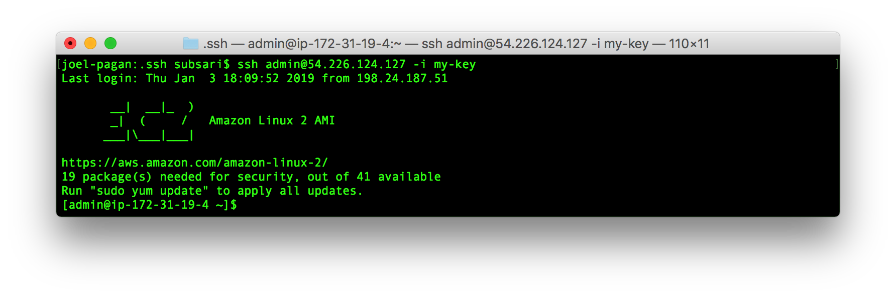
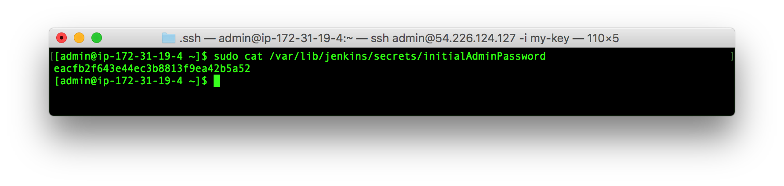
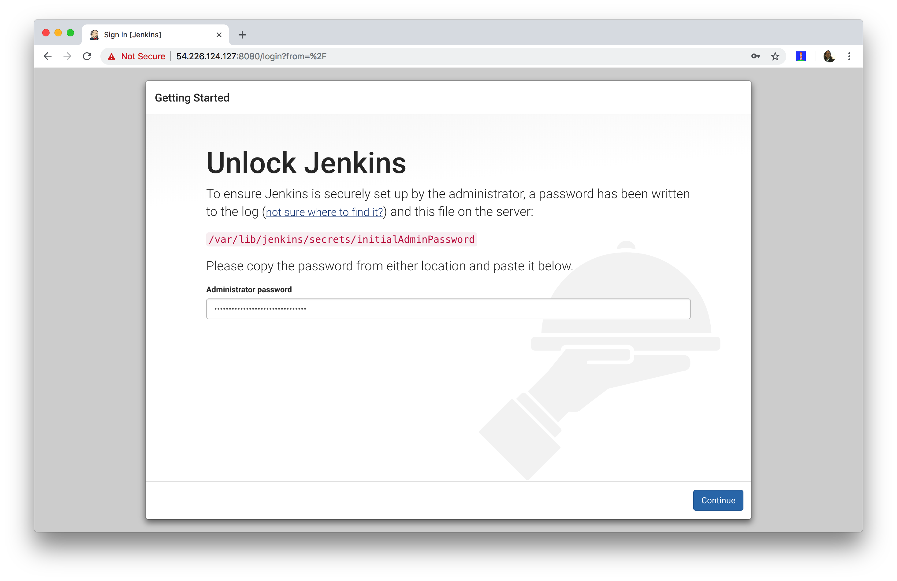
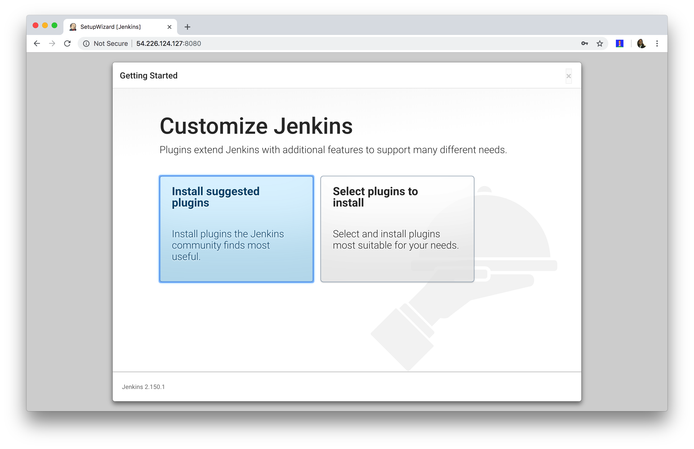
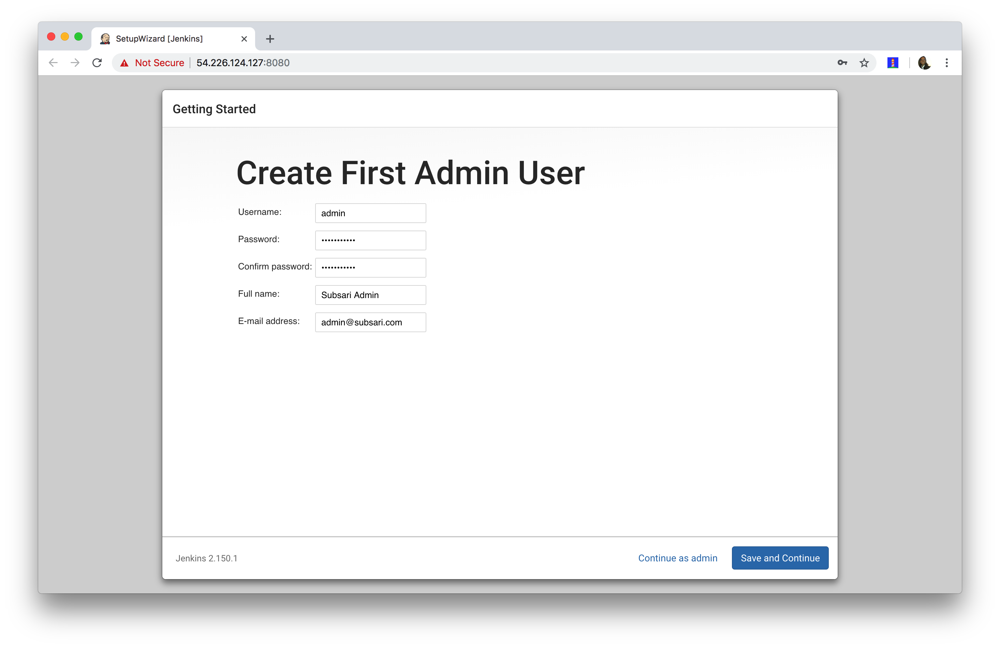
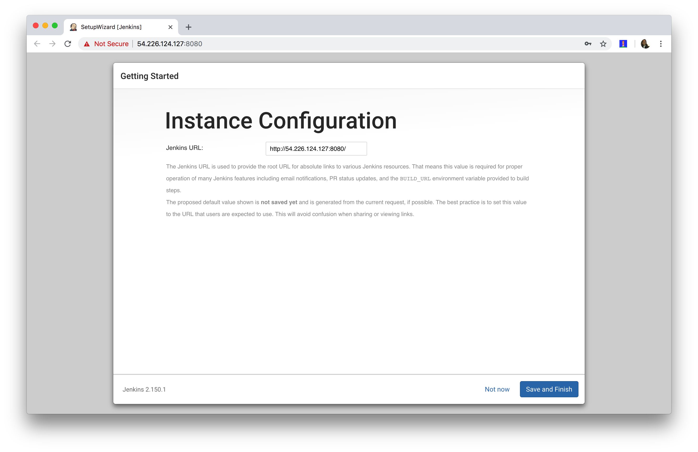
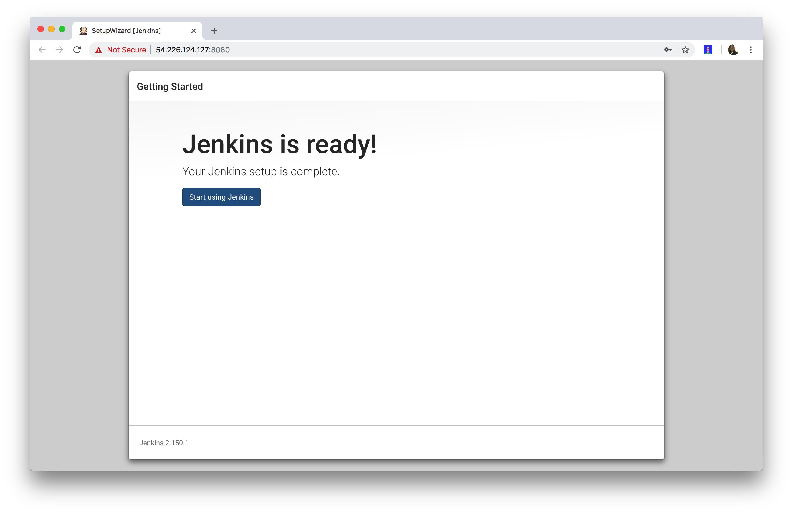

# Overview
A step-by-step guide on how to do configure Jenkins on AWS CentOS 7.

# How to Configure Jenkins 
1. Navigate To Instance

2. Connect To Instance

3. View Initial Temp Password

4. Specify Temp Password

5. Install Suggested Plugins

6. Configure Jenkins Admin User

7. Instance URL Configuration

8. Start Using Jenkins
