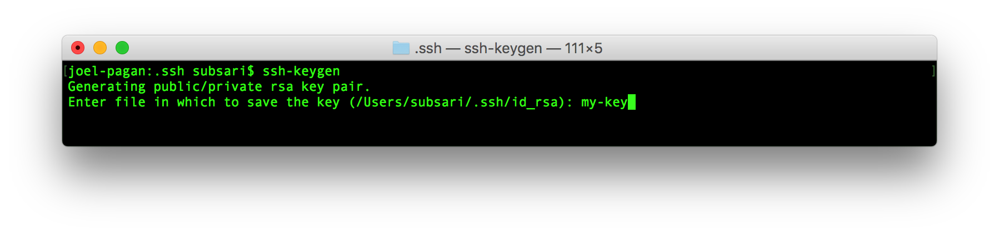
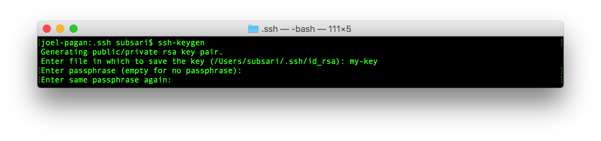
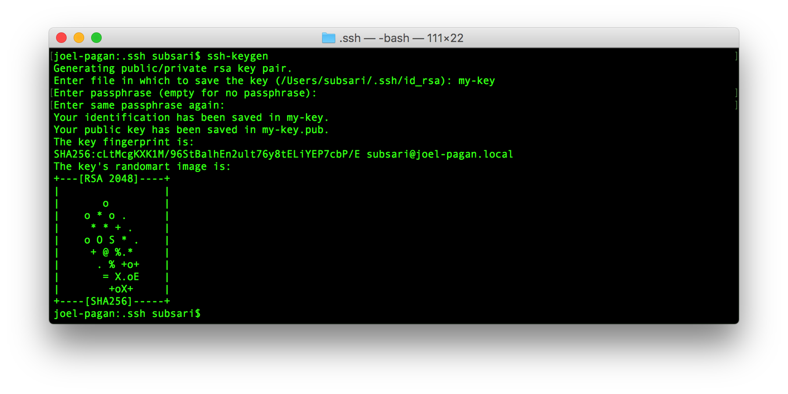
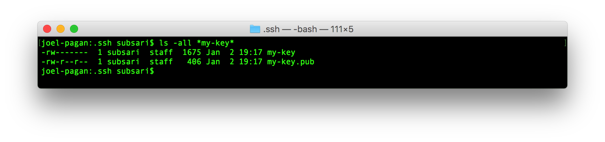
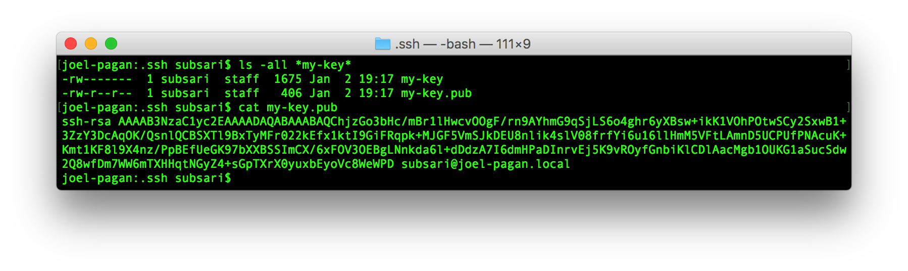

# Overview
A step-by-step guide on how to do generate an SSH Key.

# How to Generate An SSH Key
1. Open Terminal

2. Specify Key Name

3. Specify blank (nothing just press enter) for Passphrase

4. Follow Prompts Until Output

5. List Key's Files

6. View Public Key Content

Never share your private ssh key or display its content in a screenshot.