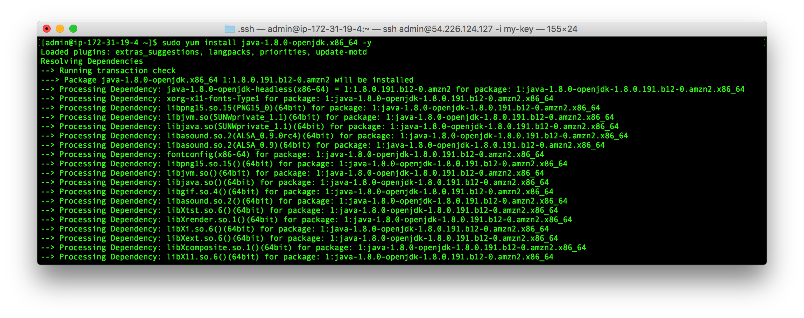
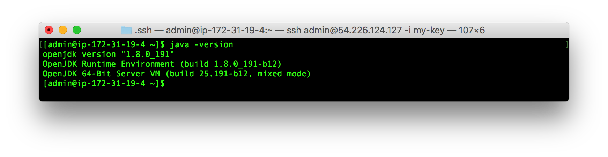
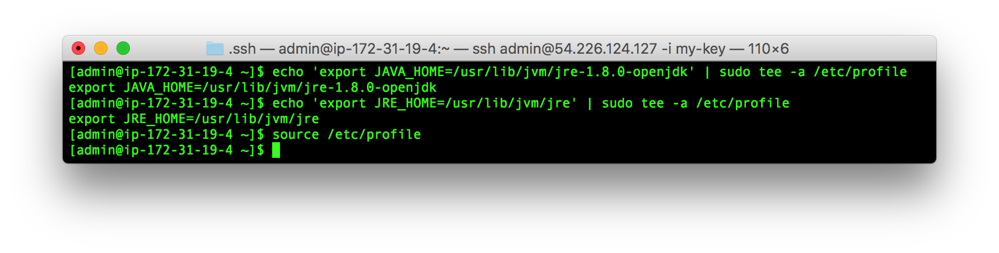

# Overview
A step-by-step guide on how to install Java on AWS CentOS 7.

# How to Generate An SSH Key
1. Connect to EC2 Instance
2. Execute Install Command

3. View Installed Version

4. Set Environment Variables


Set Java Home
```
echo 'export JAVA_HOME=/usr/lib/jvm/jre-1.8.0-openjdk' | sudo tee -a /etc/profile
```

Set JRE Home
```
echo 'export JRE_HOME=/usr/lib/jvm/jre' | sudo tee -a /etc/profile
```

Execute Source Command To Read From File
```
source /etc/profile
```