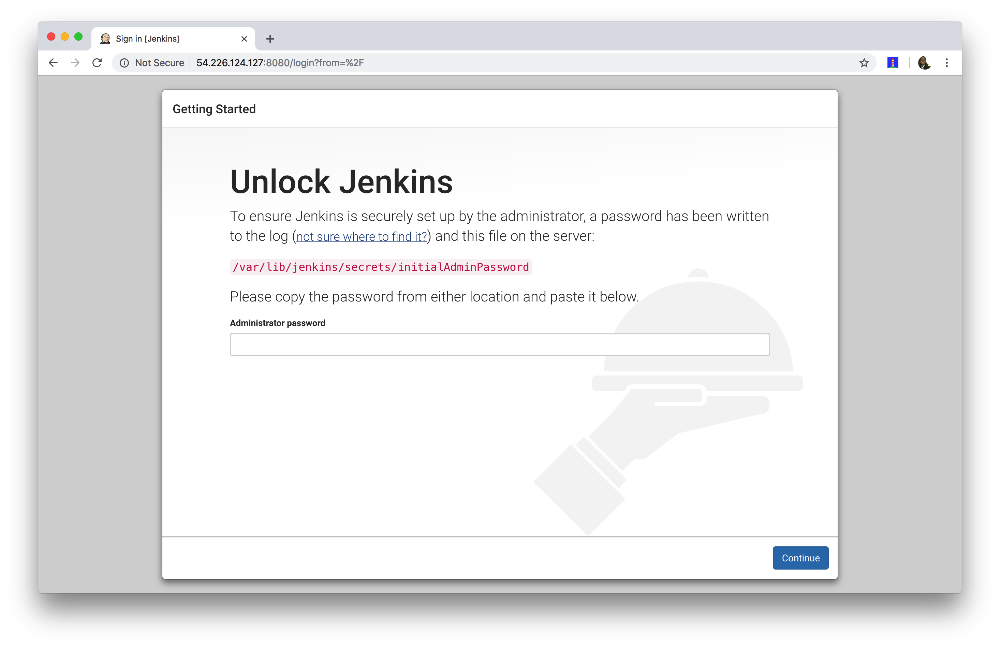

# Overview
A step-by-step guide on how to do install Jenkins on AWS CentOS 7.

# How to Install Jenkins 
0. Connect to EC2 Instance
1. Install Java [HowToInstallJava.MD](HowToInstallJava.MD)

2. Enable Jenkins Repo
```
curl --silent --location http://pkg.jenkins-ci.org/redhat-stable/jenkins.repo
```
3. Add Repo
```
sudo rpm --import https://jenkins-ci.org/redhat/jenkins-ci.org.key
```
4. Install Jenkins
```
sudo yum install jenkins -y
```
5. Enable Jenkins On Starup
```
sudo systemctl enable jenkins
```
6. Start Jenkins
```
sudo systemctl start jenkins
```
7. Check Jenkins Status
```
sudo systemctl status jenkins
```
8. Configure Firewall
```
sudo firewall-cmd --permanent --zone=public --add-port=8080/tcpsudo
```
9. Reload Firewall
```
firewall-cmd --reload
```
10. Setup Sudoer
```
sudo su
sudo echo jenkins 'ALL=(ALL) NOPASSWD:ALL'>>/etc/sudoers.d/jenkins
```
11. Navigate To Instance


If you can navigate to your instance, then Jenkins has been successfully installed and is accessible.

Continue with [HowToConfigureJenkins.MD](HowToConfigureJenkins.MD)
