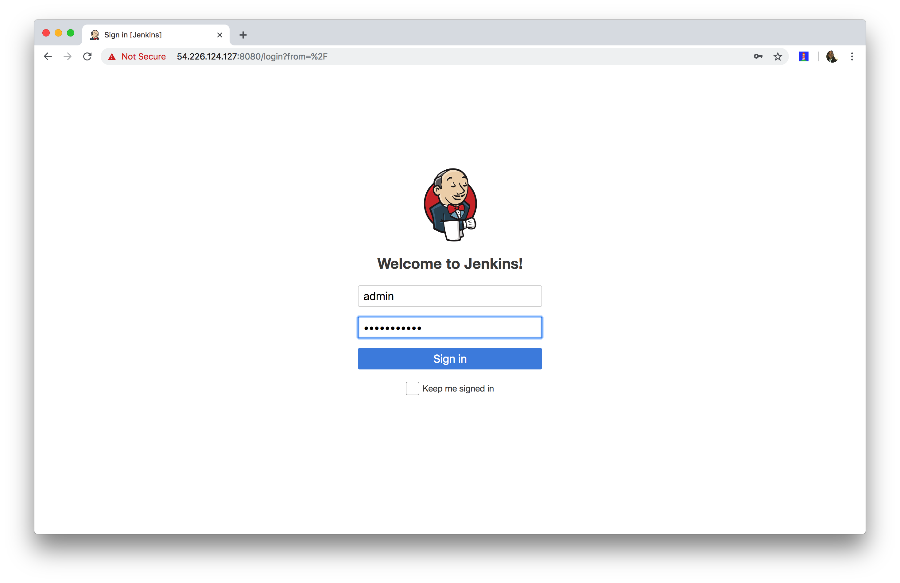
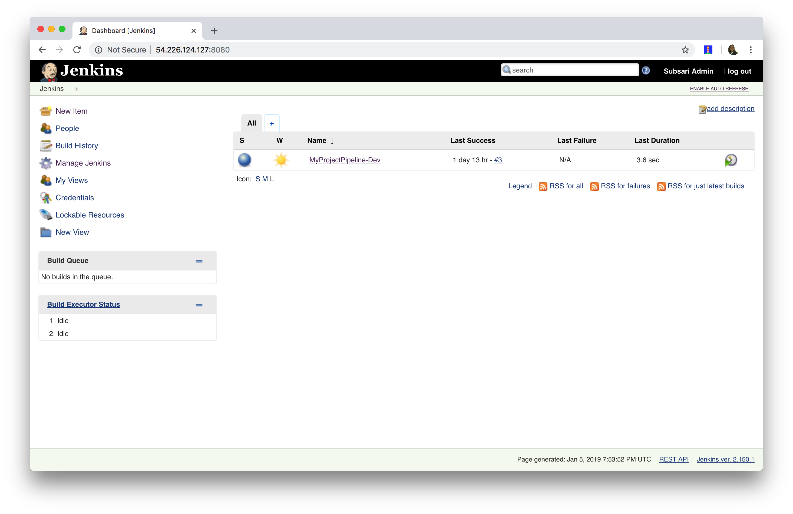
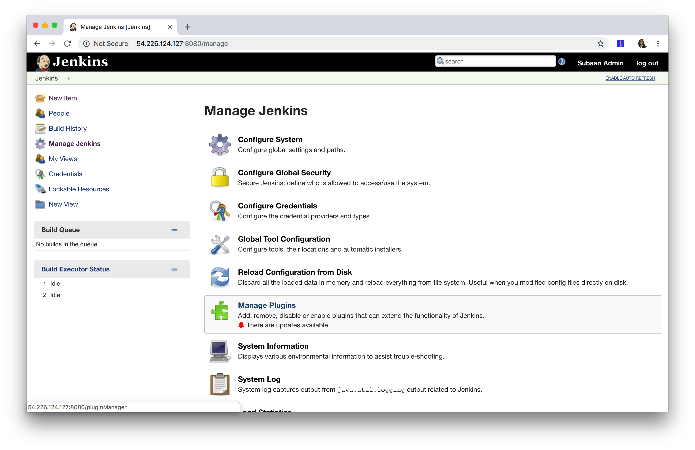
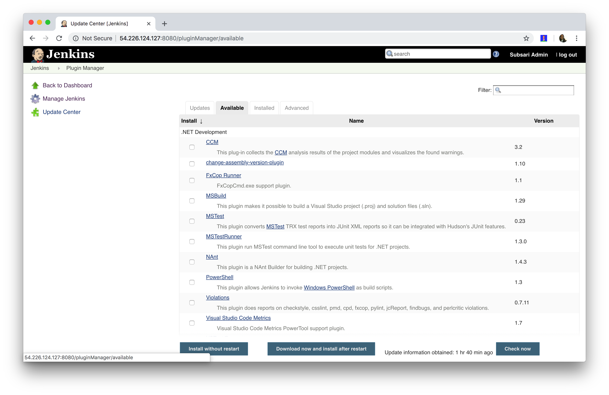
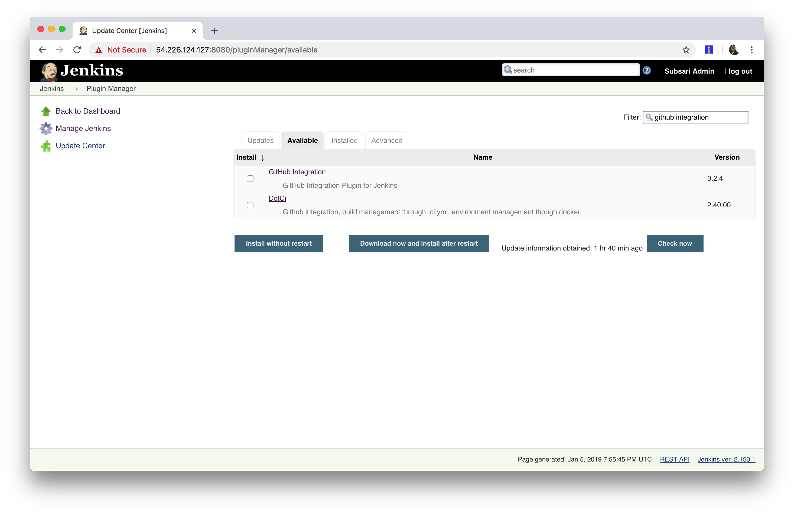
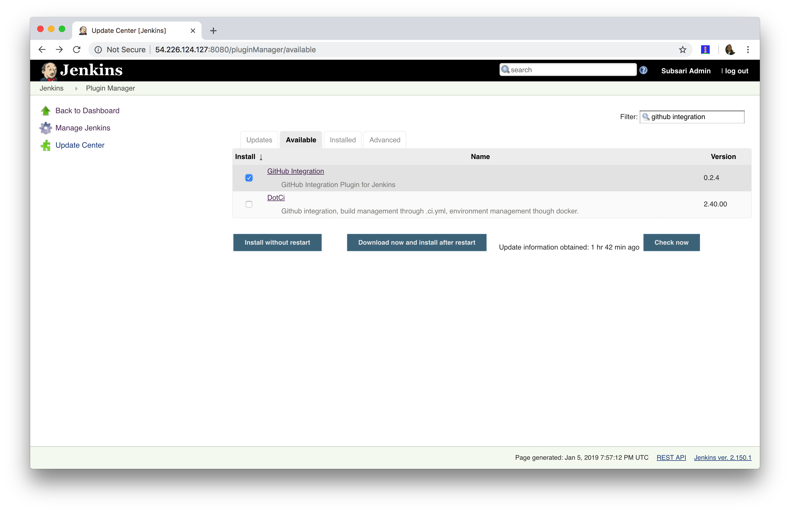
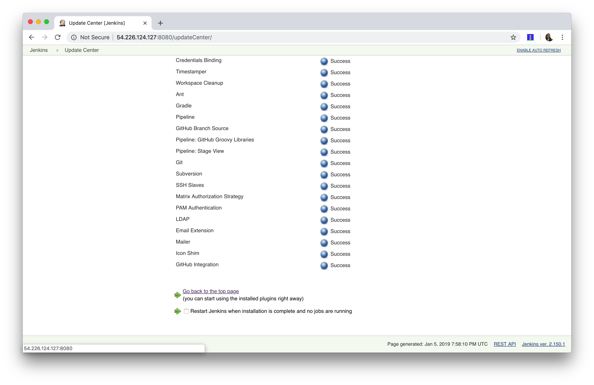

# Overview
A step-by-step guide on how to install Jenkins Github Integration plugin.

**Login To Jenkins**

**Click Manage Jenkins**

**Click Manage Plugins**

**Click Available Tab**

**Search Github Integration**

**Check Github Integration**

**Click Install Without Restart**

**All Done - Click Go Back To Top of Page**

