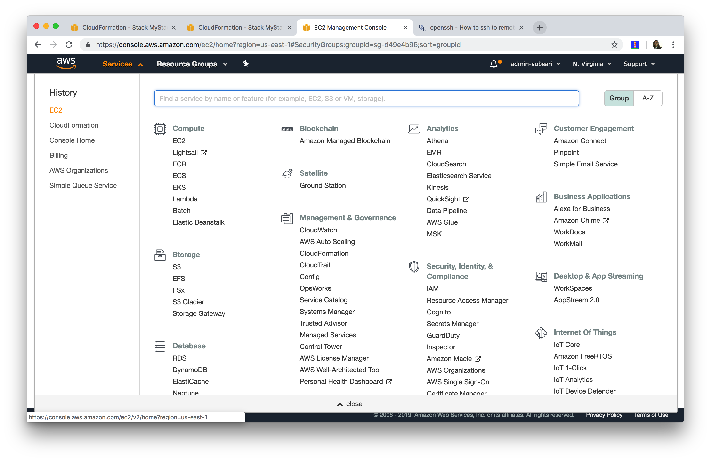
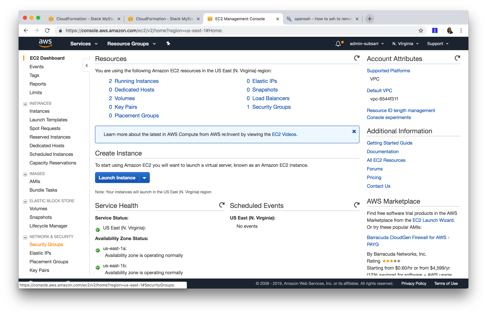
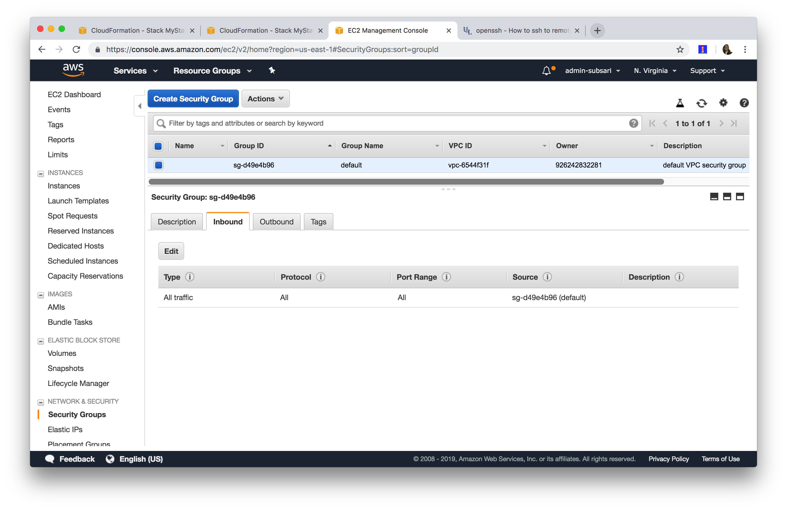
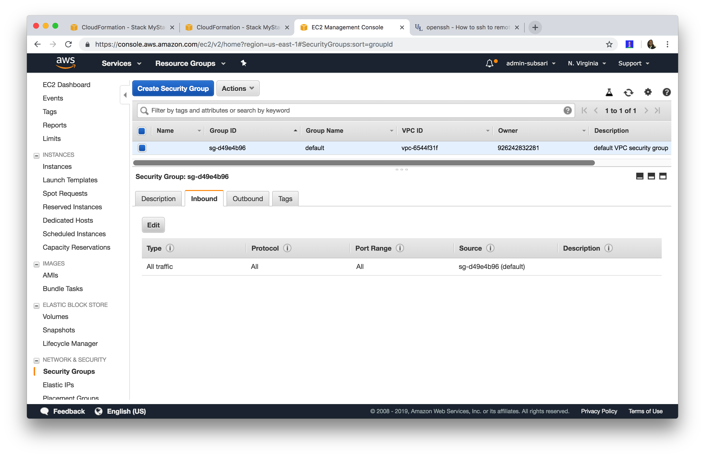
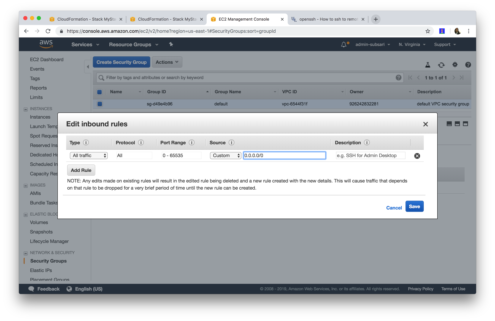
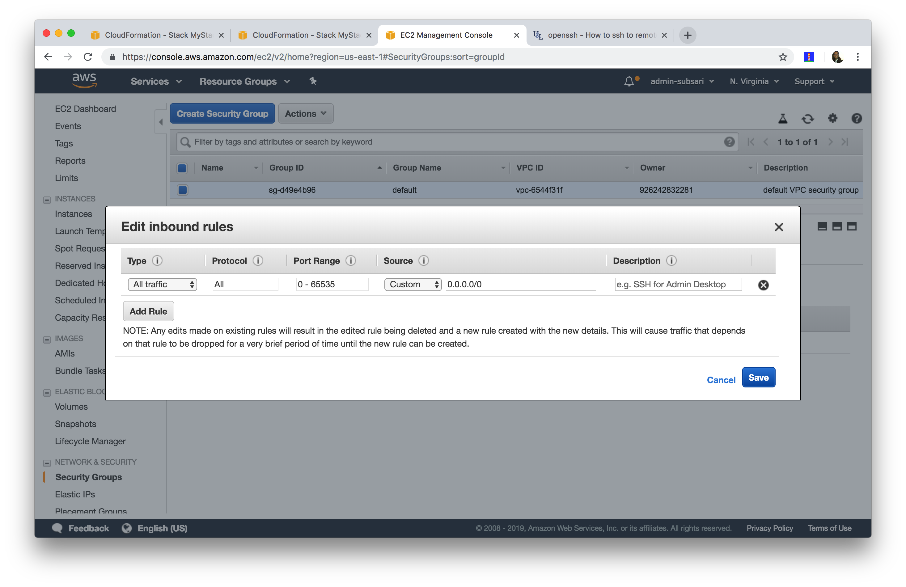

# Overview
A step-by-step guide on how to do open the security group to allow connections from any IP address.

# How to Open AWS Security Group To All IPs
1. Open AWS Services Link

2. Click Security Groups

3. Click Inbound Tab

4. Click Edit Button

5. Specify IP Range

6. Save Inbound Rules

Never leave the security group open to all IP addresses. For security measures you want to eventually come back and specify a limited set of IP addresses. It's the simplest way to secure your cloud instances.